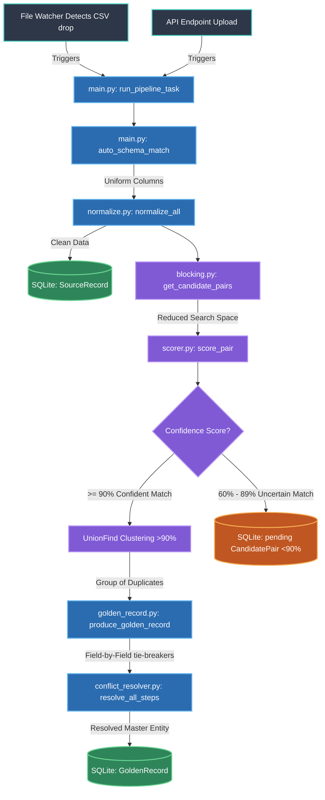

# DataDNA: End-to-End Execution Flow

This document outlines the linear execution flow of the application, starting from the moment a raw CSV file is dropped into the system, all the way to the creation of a unified Golden Record.

## 🌊 Mermaid Flow Chart

---

## 🛠️ Detailed Step-by-Step Explanation

### 1. The Input Trigger
**Files Involved:** `file_watcher.py`, `main.py`
**Functions:** `start_file_watcher()`, `_handle_new_csv()`, `@app.post("/ingest/csv")`
**What it does:** 
The pipeline starts when data is ingested. This happens in two main ways:
1.  **Passive:** `file_watcher.py` runs in the background. If you drop a `.csv` file into the `data2/` folder, the watcher detects it and triggers `_handle_new_csv()`.
2.  **Active:** The user uploads a CSV through the frontend UI, which hits the `/api/ingest/csv` endpoint.
Both methods convert the CSV into a Pandas DataFrame and send it to the core engine: `run_pipeline_task()`.

### 2. Auto-Schema Matching
**Files Involved:** `main.py`
**Functions:** `auto_schema_match()`
**What it does:** 
Different hospitals name their columns differently (e.g., `Date_of_Birth`, `DOB`, `birthdate`). The system checks a dictionary of aliases and mathematically renames incoming columns to a strictly enforced standard (like `dob`, `full_name`, `insurance_id`). 

### 3. Data Normalization
**Files Involved:** `normalize.py`
**Functions:** `normalize_all()`, `normalize_row()`
**What it does:** 
Raw data is dirty. This step cleans it. It removes spaces from phone numbers, standardizes dates into `YYYY-MM-DD` formats, converts names to title case, and strips punctuation. This ensures that "John-Doe" and "John Doe" are treated identically later.

### 4. Source Record Storage
**Files Involved:** `models.py`, `database.py`, `main.py`
**Functions:** SQLite DB interactions
**What it does:** 
Every normalized row is assigned a unique `record_id` and is permanently saved in the database as a `SourceRecord`. This allows the system to maintain "data lineage" (knowing exactly where data originally came from).

### 5. Blocking (Search Space Reduction)
**Files Involved:** `blocking.py`
**Functions:** `get_candidate_pairs()`, `get_block_key()`
**What it does:** 
Comparing 1,000 records to 1,000 records requires 1,000,000 calculations ($O(N^2)$). Blocking generates a simple grouping key (like the first 3 letters of a name + year of birth). The system only compares records that share the same block key, saving massive amounts of memory and time.

### 6. Probabilistic Scoring
**Files Involved:** `scorer.py`
**Functions:** `score_pair()`
**What it does:** 
The system mathematically compares pairs of blocked records. It uses algorithms like Jaro-Winkler and Levenshtein Edit Distance for names, and phonetic matchers for typos. It outputs a `confidence_score` between 0.0 and 1.0.

### 7. Clustering and Routing (Union-Find)
**Files Involved:** `main.py`
**Functions:** `UnionFind` class, `uf.union()`
**What it does:** 
Based on the `confidence_score`, the system routes the pair:
*   **>= 90% (Auto-Merge):** The `UnionFind` algorithm mathematically groups them together into a "cluster" of records that represent the exact same human being.
*   **60% - 89% (Human Review):** The system isn't perfectly sure. It saves them to the `CandidatePair` database table with a `pending` status. A human data steward will review these in the Intelligence Hub later.

### 8. Conflict Resolution & Golden Record Creation
**Files Involved:** `golden_record.py`, `conflict_resolver.py`
**Functions:** `produce_golden_record()`, `resolve_all_steps()`
**What it does:** 
Once `UnionFind` has created a cluster of duplicates (e.g., 3 records for "John Doe" from different hospitals), the system must merge them into one. 
If Hospital A says his phone is 123-4567, and Hospital B says it's 987-6543, `conflict_resolver.py` steps in. It evaluates rules (like choosing the most recently updated source, or the most complete record) to pick the absolute best value for every single field. 
The final, perfect synthesis is saved to the database as the master `GoldenRecord`.
